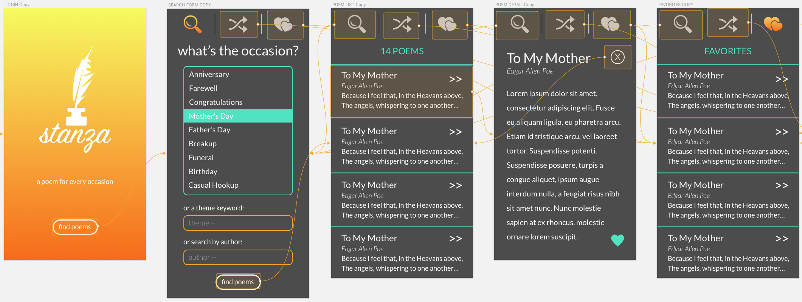

# Stanza - Poetry app
##### Robin Sola // June 2018
---

### Description
A mobile app to find poems, using PoemDB API. Search by theme, occasion, and/or author. Generate a random poem from the database. Save, store, and collect your favorite poems for easy access.

### Installation
* Clone project folder in terminal: `$ git clone` repository url
* In terminal, run `$ npm install` in project folder home directory
* In terminal, run `$ npm serve -open` to view in browser

### Brainstorming
mood:
* sleek, sexy-fresh, simple
* stanza, versify, versifier, sonnet, couplet, limerick

content & navigation:
* Logo / login form / register (probably won't have a user login)
* Nav bar: search / random poem / favorites
* Search form: theme: text / occasion: dropdown / author: text
* Poem marketplace: number of poems in search, list of poems with title / author / teaser
* Poem detail: title / author / lines / button to add to favorites / btn back to search results

icons:
* logo: ink bottle with feather pen
* search: magnify glass
* generate random poem: two arrows / shuffle icon
* list of favorites: heart with 3 lines / double hearts
* add to favorites: heart

colors:
* yellow / orange gradient
* white rgb(255, 255, 255)-#ffffff
* black rgb(0, 0, 0)-#000000
* drk gray rgb(58, 58, 58)-#3a3a3a
* lite gray rgb(109, 109, 109)-#6d6d6d

fonts:
* Lato, sans-serif (use for content)
* Dancing Script, cursive
* Sign Painter, cursive (use for logo)
* News Cycle, sans-serif
* Special Elite, cursive

### Known Bugs
Include bugs and contact information.

### Technologies and Resources
* Sketch
* HTML
* CSS / SASS
* npm / webpack
*

### License
##### Copyright (c) 2018 Robin Sola.
Permission is hereby granted, free of charge, to any person obtaining a copy of this software and associated documentation files (the "Software"), to deal in the Software without restriction, including without limitation the rights to use, copy, modify, merge, publish, distribute, sublicense, and/or sell copies of the Software, and to permit persons to whom the Software is furnished to do so, subject to the following conditions:

The above copyright notice and this permission notice shall be included in all copies or substantial portions of the Software.

THE SOFTWARE IS PROVIDED "AS IS", WITHOUT WARRANTY OF ANY KIND, EXPRESS OR IMPLIED, INCLUDING BUT NOT LIMITED TO THE WARRANTIES OF MERCHANTABILITY, FITNESS FOR A PARTICULAR PURPOSE AND NONINFRINGEMENT. IN NO EVENT SHALL THE AUTHORS OR COPYRIGHT HOLDERS BE LIABLE FOR ANY CLAIM, DAMAGES OR OTHER LIABILITY, WHETHER IN AN ACTION OF CONTRACT, TORT OR OTHERWISE, ARISING FROM, OUT OF OR IN CONNECTION WITH THE SOFTWARE OR THE USE OR OTHER DEALINGS IN THE SOFTWARE.
